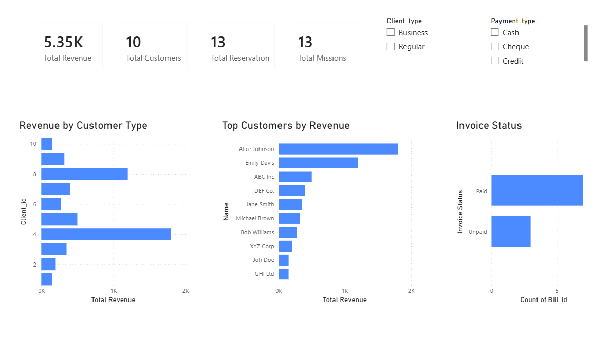
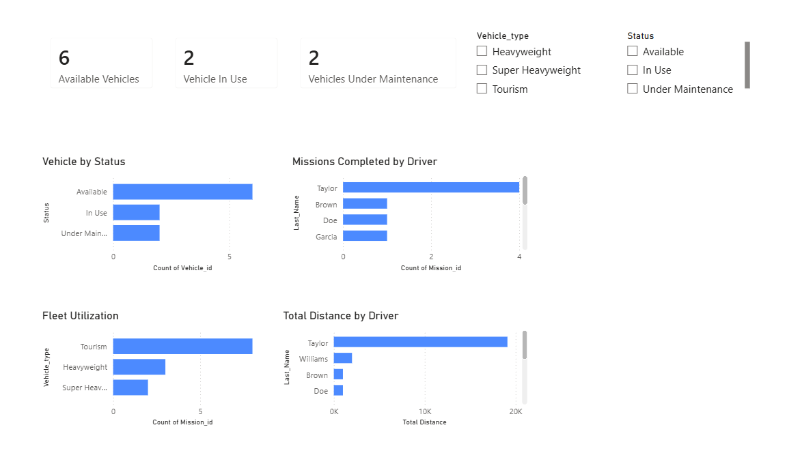
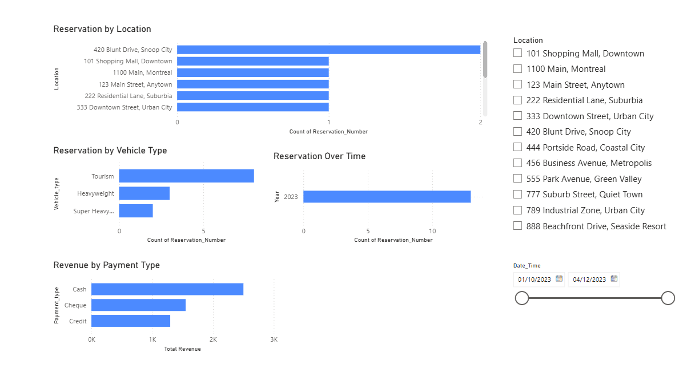

# Fleet Management Analytics Dashboard

## Overview

An end-to-end data analytics project analyzing fleet operations, reservations, customers, and revenue using SQL, Excel, Power BI, and DAX.

## Tools Used

- SQL
- Excel
- Power BI
- DAX

## Database Design

The database contains seven normalized tables:

- Client
- Vehicle
- Vehicle_Type
- Driver
- Reservation
- Mission
- Bill

## Dashboard Pages

### Executive Overview

Includes:
- Total Revenue
- Total Customers
- Total Reservations
- Total Missions
- Revenue by Customer Type
- Invoice Status



---
### Fleet Operations

Includes:
- Vehicle Status
- Missions by Driver
- Fleet Utilization
- Distance Travelled




---

### Reservation Analytics

Includes:
- Reservations by Date
- Reservations by Location
- Vehicle Type Demand
- Revenue by Payment Type



---

## Skills Demonstrated

- SQL Database Design
- Data Modeling
- Data Cleaning
- DAX Measures
- Power BI Dashboard Development
- Business Intelligence Reporting

---

# Project Files

```text
Dataset/
└── Vehicle_Fleet_Analytics.xlsx

SQL/
├── 01_create_tables.sql
├── 02_insert_data.sql
└── 03_analysis_queries.sql

PowerBI/
└── Fleet_Management_Dashboard.pbix

Images/
├── Executive_Overview.png
├── Fleet_Operations.png
└── Reservation_Analytics.png
```
